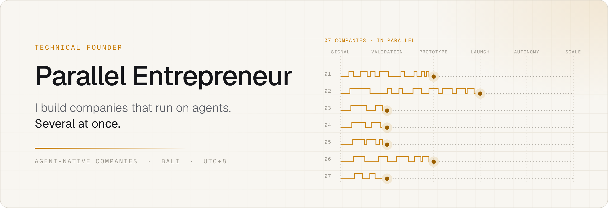
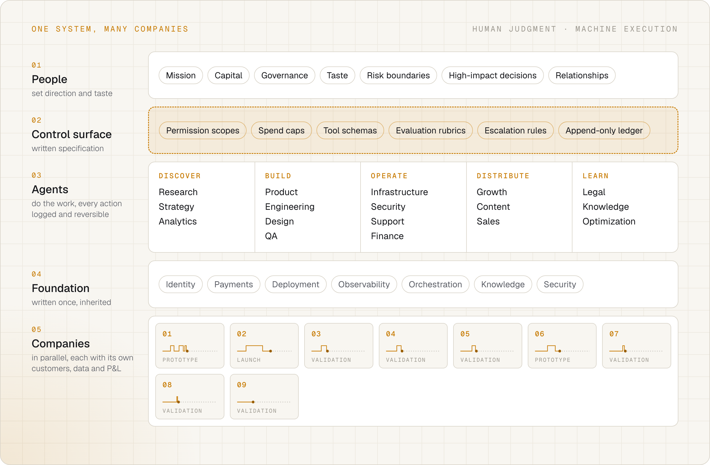
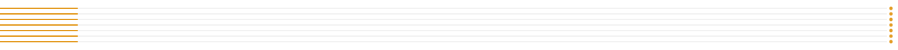
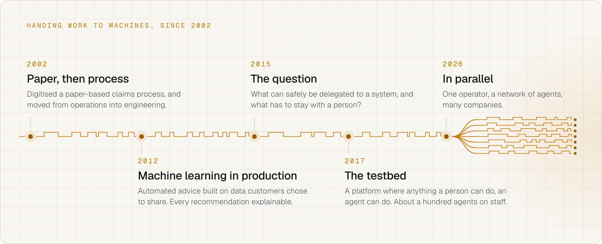

<picture>
  <source media="(prefers-color-scheme: dark)" srcset="assets/header-dark.png">
  
</picture>

  
  

## Several companies, one operating system

Most founders give one company a decade. I start several at the same time.

That only works because none of them is built from scratch. Every company sits on
one shared operating system: identity, payments, deployment, observability, agent
orchestration and knowledge are written once and inherited. Each company keeps its
own product, customers, data and P&L. Agents do the work of running them, from
research and engineering to support, content and growth. People set the direction,
hold the boundaries and make the calls that need a person.

The studio this runs in is [Factory Zero](https://factory0.ventures): one operator
and a network of agents. The claim being tested is that a studio that size can hold
this many companies at once. Seven are in the pipeline today, between validation and
launch. Judge it on the outputs.

<picture>
  <source media="(prefers-color-scheme: dark)" srcset="assets/operating-model-dark.png">
  
</picture>

## Agent-native, in production

The model had a proving ground before the studio existed. I have run the same company
since 2017, and it is now built so that anything a person can do in the operator
console, an agent can do through a CLI, an MCP server or a typed SDK. It is live in
six countries, with real money moving through it.

- About a hundred agents cover engineering, operations and go-to-market.
- Human headcount went from 25+ to four operators, while shipping roughly three times faster.
- I don't hold the CEO title there. I manage the CEO agent.

## What makes autonomy safe to ship

Handing work to an agent is the easy part. Keeping it safe in production is the job,
and most of that job is writing.

- **Scoped authority.** Per-agent permission scopes, scoped API tokens and spend caps.
  An agent can do what its role allows and nothing beside it.
- **A ledger, not a log.** Every agent action lands in an append-only ledger, so it can
  be audited and reversed.
- **Written specification.** Tool schemas, evaluation rubrics and escalation rules
  decide what an agent may do and when a person takes over.
- **Evaluation before exposure.** Models fine-tuned on domain data, self-learning loops
  that feed each run into the next, and a readiness review before any agent capability
  reaches a customer.

  

## How I got here

<picture>
  <source media="(prefers-color-scheme: dark)" srcset="assets/timeline-dark.png">
  
</picture>

I put machine learning in front of customers for the first time in 2012: automated
advice built on the data people chose to share, in a market where automated advice
is supervised advice. Every recommendation had to be explainable and auditable, and
I owned the tradeoffs between automation, explainability and coverage.

Reading Bostrom's *Superintelligence* in 2015 sharpened that into the question I have
worked on ever since: what can safely be delegated to a system, and what has to stay
with a person? Everything on this page is my answer, tested in production rather than
in argument.

## Toolbox

**Agents** &nbsp; MCP servers · tool schemas · custom CLIs · OpenAPI-generated typed SDKs · scoped permissions · audit trails 
**Models** &nbsp; RAG · fine-tuning on domain data · self-learning loops · evaluation rubrics · local inference on owned GPUs 
**Build** &nbsp; TypeScript · Node.js · Rust · iOS, Android and PWA · cloud-agnostic deployment · agentic coding

## Say hello

Alongside the studio I take on a few side roles in applied AI, up to 20 hours a week
and remote, because they are how I keep learning. I work from Bali (UTC+8) and overlap
comfortably with European mornings.

[Get in touch through Factory Zero](https://factory0.ventures/enter/)

Enjoying the simulation.
